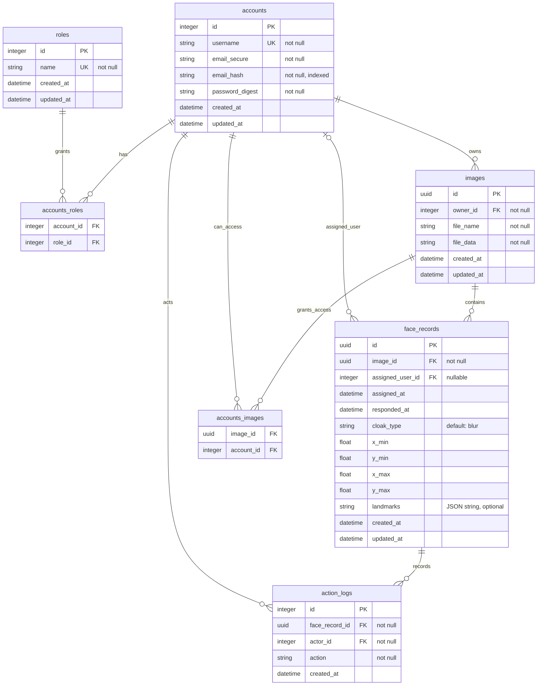

# Database Schema

The database schema for FaceCloak API is designed to support automated face detection and a zero-trust privacy control model.

## Entities

- **Accounts**: Stores user information with encrypted PII (email) and salted/hashed passwords.
- **Roles**: Enumerates system roles (e.g., owner, user).
- **Images**: Stores image metadata and links to physical storage. Images are owned by an account.
- **FaceRecords**: Represents detected faces within an image. Each face can be assigned to a user who controls its privacy state. Coordinates are stored as normalized floats, and `landmarks` is an optional JSON string used only when a detector provides landmark data.
- **ActionLogs**: Audit trail for all state-changing operations on face records.
- **Join Tables**:
    - `accounts_roles`: Many-to-many relationship between users and roles.
    - `accounts_images`: Manages access permissions for assignees.

## Constraints & Relationships

- `accounts.username` is unique.
- `roles.name` is unique.
- `images` has a unique `[owner_id, file_name]` constraint.
- `face_records` has a unique `[image_id, assigned_user_id]` constraint, enforcing one assigned face per user per image when `assigned_user_id` is present.
- Deleting an `image` cascades to its `face_records`.
- Deleting a `face_record` cascades to its `action_logs`.
- Deleting an assigned `account` sets `face_records.assigned_user_id` to `NULL`.
- Deleting an owner account cascades to owned `images`.
- Deleting an actor account cascades to its `action_logs`.

## Security Rationale

- **Hybrid IDs**: Incrementing integers for internal account management; UUIDs for public-facing resources (Images, FaceRecords) to prevent enumeration attacks.
- **PII Protection**: Sensitive fields like email are stored as encrypted ciphertext with a separate HMAC hash for deterministic lookup.
- **Cascade Behavior**: Strict foreign key constraints ensure that deleting an image automatically removes its associated face records and audit logs.
